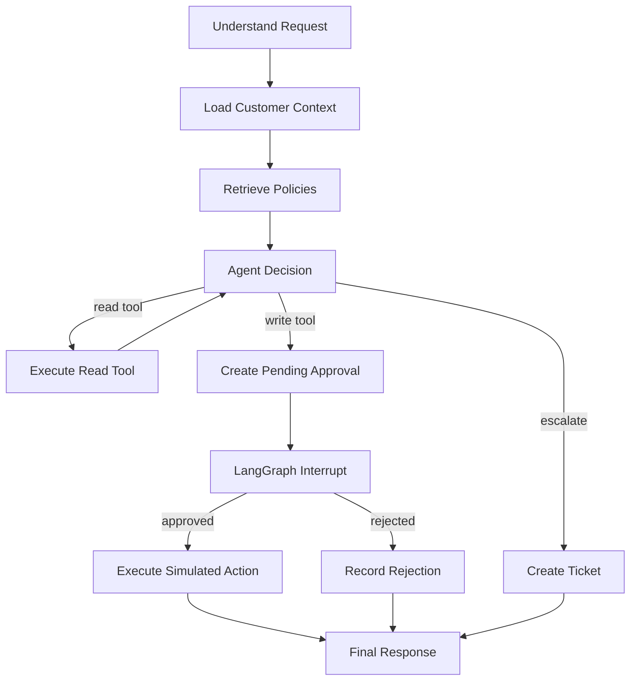

# Agent Workflow

```mermaid
flowchart TD
  A[Understand Request] --> B[Load Customer Context]
  B --> C[Retrieve Policies]
  C --> D[Agent Decision]
  D -->|read tool| E[Execute Read Tool]
  E --> D
  D -->|write tool| F[Create Pending Approval]
  F --> G[LangGraph Interrupt]
  G -->|approved| H[Execute Simulated Action]
  G -->|rejected| I[Record Rejection]
  H --> J[Final Response]
  I --> J
  D -->|escalate| K[Create Ticket]
  K --> J
```

Interrupted runs persist via SQLite checkpointer (`CHECKPOINTER_BACKEND=sqlite`) plus ResolveAI approval/agent tables for recovery.
